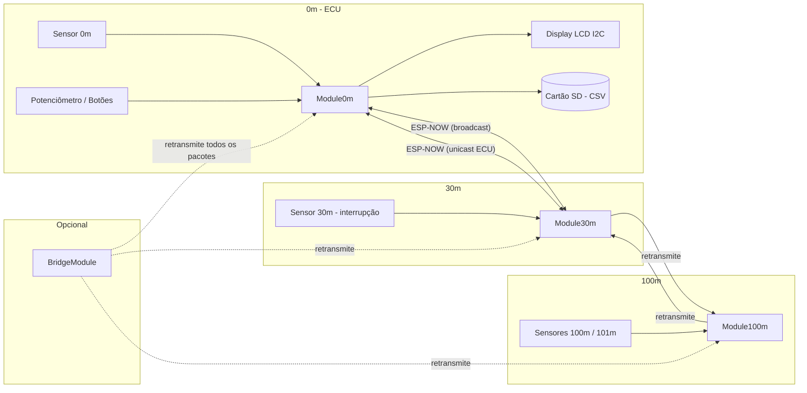
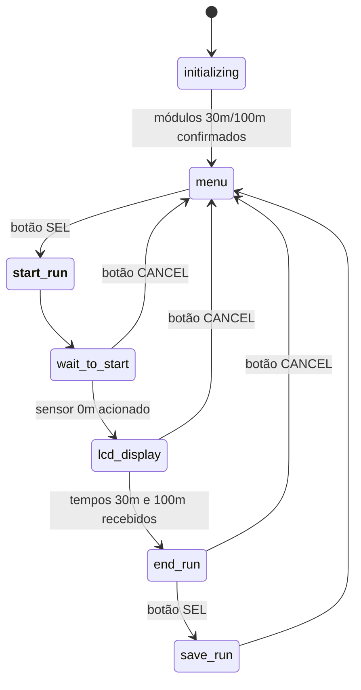
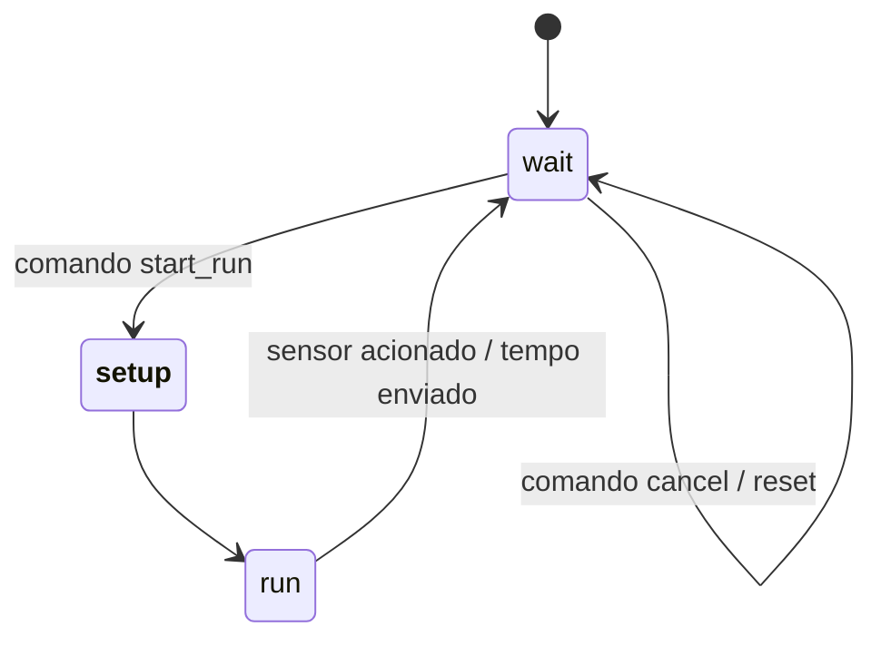

# AV Test


Sistema de cronometragem para teste de aceleração e velocidade veicular, da equipe **Mangue Baja (UFPE)**. Mede com precisão os tempos de passagem do veículo em distâncias predefinidas (30 m e 100 m), calcula a velocidade final e registra tudo em cartão SD — usando uma rede de módulos ESP32 comunicando-se via **ESP-NOW**.

## Visão geral

O sistema é composto por uma **ECU** (módulo de 0 m, com LCD e cartão SD) e módulos sensores remotos posicionados a 30 m e 100 m da largada. Um módulo **Bridge** opcional pode ser usado para retransmitir pacotes e estender o alcance da rede.

* A ECU inicia e cancela as corridas, coordena a máquina de estados de toda a rede e exibe os tempos no LCD.
* O módulo de 30 m detecta a passagem do veículo por interrupção de hardware e também atua como ponte entre a ECU e o módulo de 100 m.
* O módulo de 100 m mede dois tempos consecutivos (100 m e 101 m), permitindo calcular a velocidade final do veículo.
* Todos os módulos implementam a mesma interface (`IModule`), o que permite que `main.cpp` instancie qualquer um deles de forma genérica, bastando trocar a constante `MODE`.

## Arquitetura



Toda a comunicação passa pela struct única `av_packet_t`, com um `message_id` para evitar loops de retransmissão — usado principalmente pelo `BridgeModule`, que mantém um cache dos últimos IDs já retransmitidos.

## Estrutura de arquivos

```
AV Test/
├── backup/              # Arquivos de backup de versões anteriores
├── include/             # Arquivos de cabeçalho globais
│   ├── hardware_defs.h  # Definições de pinos de hardware
│   └── packets.h        # Estruturas de dados e enums de comunicação
├── lib/                 # Bibliotecas de código fonte dos módulos
│   ├── AV_espnow/       # Funções de wrapper para a comunicação ESP-NOW
│   ├── Bridge/          # Módulo ponte (repetidor de sinal)
│   ├── IModule/         # Interface base para todos os módulos
│   ├── LCD/             # Funções de controle do display LCD
│   ├── Module0m/        # Módulo ECU (0 metros)
│   ├── Module30m/       # Módulo sensor de 30 metros
│   ├── Module100m/      # Módulo sensor de 100 metros
│   └── SD/              # Funções para o cartão SD
├── src/
│   └── main.cpp          # Ponto de entrada — seleciona o módulo ativo via MODE
├── platformio.ini
└── README.md
```

## Módulos

Selecionáveis em `src/main.cpp` através da constante `MODE` (`enum class ModuleID`):

| Módulo | Classe | Responsabilidade |
|---|---|---|
| `ModuleID::ECU` | `Module0m` | Inicia/cancela corridas, recebe os tempos de 30 m e 100 m, exibe no LCD e salva no SD |
| `ModuleID::Sensor30m` | `Module30m` | Detecta a passagem por interrupção no sensor de 30 m; retransmite mensagens entre a ECU e o módulo de 100 m |
| `ModuleID::Sensor100m` | `Module100m` | Detecta a passagem nos sensores de 100 m e 101 m (polling), permitindo calcular a velocidade final |
| `ModuleID::Bridge` | `BridgeModule` | Retransmite todos os pacotes ESP-NOW recebidos, com cache de `message_id` para evitar loops |

Todos herdam de `IModule`, que define os métodos `setup()` e `loop()` implementados por cada módulo.

## Máquinas de estado

**ECU (`av_ecu_t`):**



**Sensores remotos (`state_t`, usado por `Module30m` e `Module100m`):**



## Protocolo de comunicação (ESP-NOW)

### Identificação dos módulos (`module_t`)

| Valor | Nome | Descrição |
|---|---|---|
| 0 | `metros_0` | Módulo ECU (0 m), com LCD e cartão SD |
| 1 | `metros_30` | Módulo sensor de 30 m |
| 2 | `metros_100` | Módulo sensor de 100/101 m |
| 3 | `bridge` | Módulo ponte/repetidor |

### Comandos da máquina de estados (`state_machine_command_t`)

| Valor | Nome | Descrição |
|---|---|---|
| `0xff` | `do_nothing` | Comando nulo, para preenchimento |
| `0x00` | `check_module` | Verifica quais módulos estão online |
| `0x03` | `cancel` | Cancela uma corrida em andamento |
| `0x04` | `start_run` | A ECU inicia a cronometragem em todos os módulos |
| `0x05` | `flag_30m` | Confirmação de presença enviada pelo módulo de 30 m |
| `~0x05` | `end_run_30m` | Módulo de 30 m envia o tempo de passagem |
| `0x06` | `flag_100m` | Confirmação de presença enviada pelo módulo de 100 m |
| `~0x06` | `end_run_100m` | Módulo de 100 m envia os tempos de passagem (100 m e 101 m) |
| `0x07` | `reset_` | Reinicia todos os módulos |

### Estrutura do pacote (`av_packet_t`)

| Campo | Tipo | Descrição |
|---|---|---|
| `message_id` | `uint32_t` | ID único da mensagem, usado pelo `BridgeModule` para evitar loops de retransmissão |
| `original_sender_mac` | `uint8_t[6]` | MAC do remetente que originou a mensagem |
| `id` | `uint8_t` | Módulo remetente/retransmissor, conforme `module_t` |
| `command_for_state_machine` | `uint8_t` | Comando para a máquina de estados, conforme `state_machine_command_t` |
| `mac_address` | `uint8_t[6]` | MAC do remetente original (usado pela ECU para registrar peers) |
| `time` | `unsigned long` | Timestamp principal (tempo em 30 m ou em 100 m) |
| `timer2` | `unsigned long` | Timestamp secundário (tempo em 101 m) |

## Hardware e pinagem

Definições em `include/hardware_defs.h`:

| Periférico | Pino | Módulo |
|---|---|---|
| SD CS | GPIO2 | 0m |
| Potenciômetro (menu) | GPIO35 | 0m |
| Botão Seleção | GPIO14 | 0m |
| Botão Cancelar/Reset | GPIO13 | 0m |
| Sensor 0m | GPIO15 | 0m |
| Sensor 30m | GPIO5 | 30m |
| Sensor 100m | GPIO5 | 100m |
| Sensor 101m | GPIO18 | 100m |

> O display LCD usa I2C no endereço `0x27` (16x2), configurado em `LCD.cpp`.

## Armazenamento no cartão SD

A ECU cria um novo arquivo `AV_dataN.csv` a cada inicialização (numeração sequencial, sem sobrescrever dados anteriores), com o cabeçalho:

```
tempo_30,tempo_100,velocidade
```

## Dependências

| Biblioteca | Fonte | Uso |
|---|---|---|
| `esp_now.h` | ESP-IDF / Arduino-ESP32 core | Comunicação ESP-NOW entre os módulos |
| `WiFi.h` | Arduino-ESP32 core | Modo estação (STA) necessário para o ESP-NOW e leitura do MAC address |
| `Ticker.h` | Arduino-ESP32 core | Reabilita o botão de reset da ECU após um cancelamento |
| `driver/gpio.h` | ESP-IDF | Definições de pinos em `hardware_defs.h` |
| `SD.h` | Arduino core | Leitura/escrita do cartão SD |
| `LiquidCrystal_I2C` | Biblioteca externa | Controle do display LCD 16x2 via I2C |

## Como compilar e gravar

Este projeto usa [PlatformIO](https://platformio.org/).

1. Em `src/main.cpp`, defina qual módulo será gravado alterando a constante `MODE`:

    ```cpp
    #define MODE ModuleID::Sensor100m   // ou ECU, Sensor30m, Bridge
    ```

2. Compile e grave no ESP32 conectado:

    ```bash
    pio run --target upload
    ```

3. Acompanhe os logs pelo monitor serial:

    ```bash
    pio device monitor
    ```

Repita o processo para cada ESP32 da rede, selecionando o `MODE` correspondente a cada posição (ECU, 30 m, 100 m e, opcionalmente, Bridge).

## Equipe

Projeto mantido pela equipe **Mangue Baja**, da Universidade Federal de Pernambuco (UFPE), competidora do Baja SAE Brasil.
